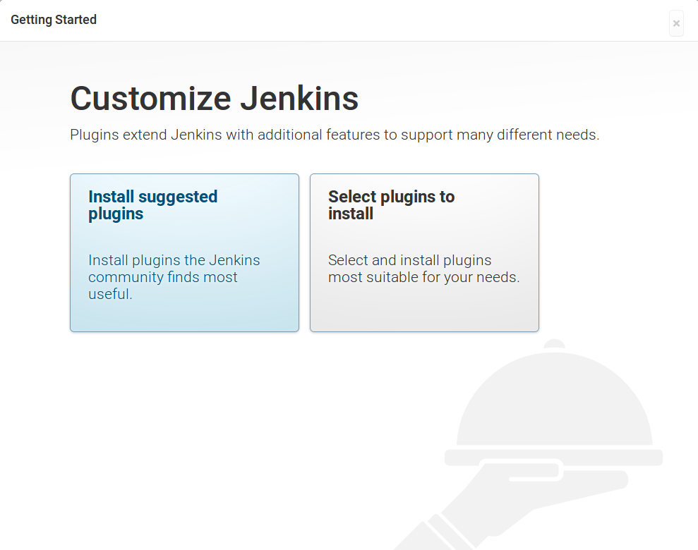
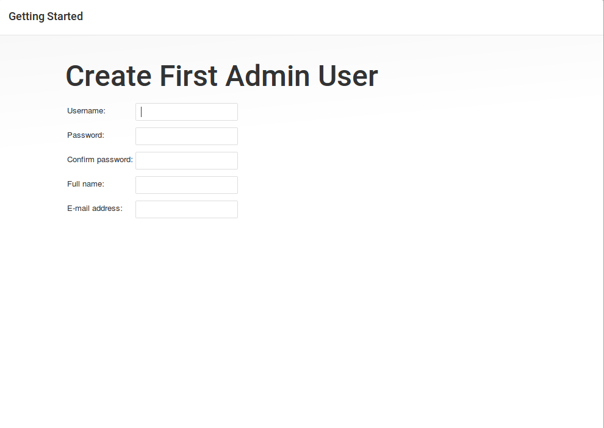
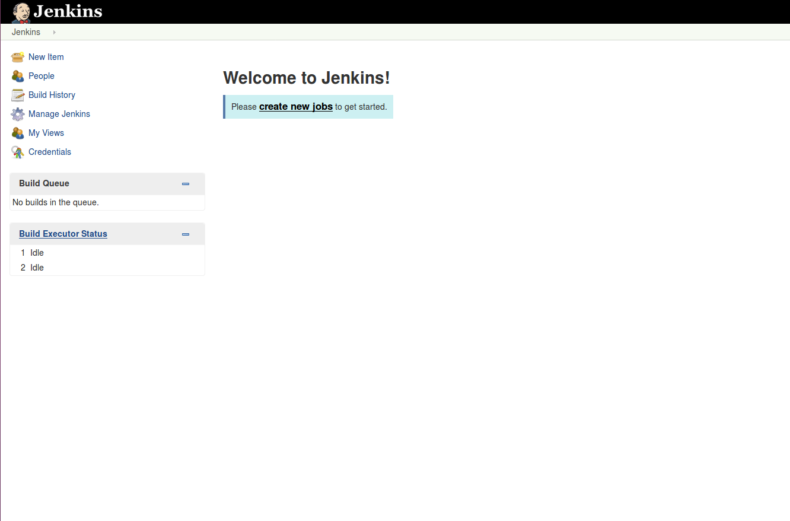
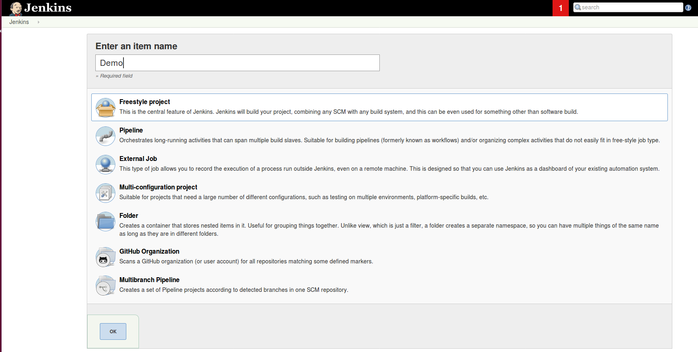
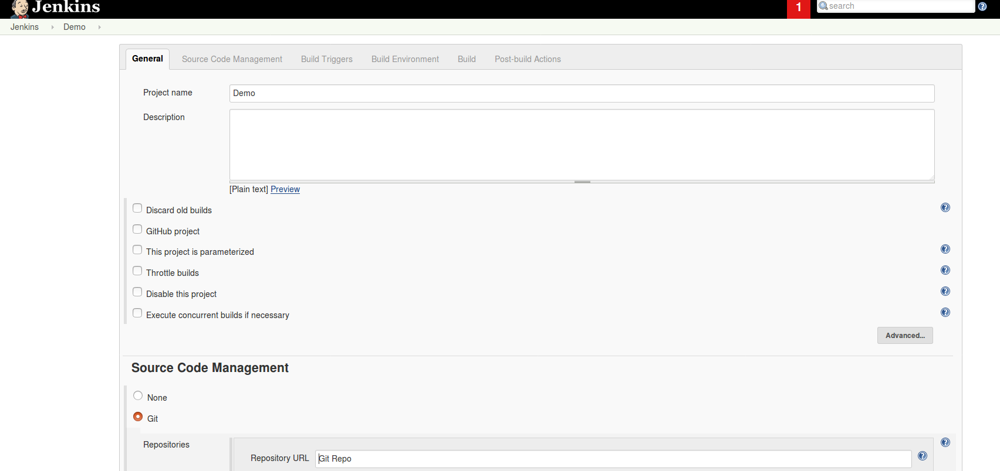

# OpenStack Image Factory

If you've been with us for the last few months, you have certainly seen the [5 Minutes Stacks](http://dev.cloudwatt.com/fr/recherche.html?q=5+minutes+stacks&submit=submit) on our tech blog. Now, we offer you a chance to go backstage and create your own bundles! Follow this guide to get started... and watch your step: this stuff is *potent*.

## The Factory

Each episode presented a Heat stack based on a unique pre-built server image. These images were already packed with the related tools for a faster deployment. The toolbox used to create these practical images is simple and efficient... and completely open-source:

* *Debian Jessie:* OS on which the Factory rests.
* *Openstack CLI:* Crucial for integrating the images into the Cloudwatt Platform
* *Packer:* Created by Hashicorp, this tool utilizes a Builder and Provisioner system to assemble the server images for various platforms, notably OpenStack.
* *Ansible:* A configuration tool from the same family as Puppet, Chef, and SaltStack. The lack of need for an agent in order to function sets Ansible apart.
* *Shell:* Bash is great.

To facilitate you in the creation of new images, we've place our assembly line [on Github](https://github.com/cloudwatt/os_image_factory).
 
We've also prepared a HEAT stack that will provide you with an image build server with all the necessary tools. For a little
more comfort, we added a Jenkins server in the toolbox. So, to start your own factory:

The prerequisites to deploy this stack :

* Your [Cloudwatt account](https://www.cloudwatt.com/cockpit/#/create-contact),
* An existing [existing key pair](https://console.cloudwatt.com/project/access_and_security/?tab=access_security_tabs__keypairs_tab)
* Launch the HEAT stack that will assemble the factory via [OneClick](https://www.cloudwatt.com/en/applications/) or directly by retrieving the Heat template on [the cloudwatt github](https://github.com/cloudwatt/os_image_factory/tree/master/setup)

The provisioning of this server is done starting from a **bundle** images with all the necessary tools. To minimize the risks, we decided to only allow connections via SSH. To access the plant's Jenkins,
An SSH tunnel with port forwarding, between your machine and the server :

```
ssh $FACTORY_IP -l cloud -i $YOU_KEYPAIR_PATH -L 8080:localhost:8080
```

You should be able to access the factory Jenkins by clicking [here](http://localhost:8080)

To complete the installation, a manual operation is necessary. You have to manually in  ```/var/lib/jenkins/secrets/initialAdminPassword``` file via the SSH connexion.

```
sudo cat /var/lib/jenkins/secrets/initialAdminPassword
```

Install Suggested Plugins



Enter now your informations that will secure your jenkins. 
Keep in mind that all of you Cloudwatt account information are saved by jenkins. That's why the security is a very important thing with this Factory.



Jenkins is now initialized.

First of all, discovering the assembly line to know the build process.

## The Assembly Line

In the `images/` directory you will find 4 files essential to the creation of new images.

* `ansible_local_inventory`: Ansible inventory file, injected by Packer into the provisioning image to allow Ansible to target the server.
* `build.packer.json`: Packer build file. It takes into account the parameters given to it by the Ansible playbook.
* `build.playbook.yml`: Ansible playbook which pilots the building of images.
* `build.sh`: Short shell script to simplify the use of the Ansible playbook.

The `images/` subdirectories are build examples, each containing the files needed to create a server image. To create your own just apply to following norm:

~~~
images/
    bundle-my-bundle/             # <-- Build directory
        ansible/
            bootstrap.yml         # <-- Ansible playbook for server provisioning
        output/
            my_stack_heat.yml.j2  # <-- Template to generate at the end of the build, currently a Heat template
        build-vars.yml            # <-- Build variables/settings, used by Packer and the piloting Ansible playbook

~~~

The `.j2` ([Jinja2](http://jinja.pocoo.org/)) templates you place in `bundle-my-bundle/output/` will be interpreted by the piloting Ansible playbook. We use them to generate your bundle's Heat template:

~~~ yaml
server:
    type: OS::Nova::Server
    properties:
      key_name: { get_param: keypair_name }
      image: {{ result_img_id }}             # <-- Will be replaced by generated image ID
      flavor: { get_param: flavor_name }
      networks:

~~~

The `build-vars.yml` file contains the variables given to the piloting Ansible playbook:

~~~ yaml
bundle:
  name: bundle-my-bundle                          # <-- Image name
  img_base: ae3082cb-fac1-46b1-97aa-507aaa8f184f  # <-- Glance ID of image to use as base
  properties:                                     # <-- Properties you want applied
    img_os: Ubuntu                                #     to the final image
    cw_bundle: MY_BUNDLE
    cw_origin: Cloudwatt
    hw_cpu_max_sockets: 1
    hw_rng_model :virtio     
~~~

Now that you have knowledge of the entire assembly line of an image, you can start  building your own image bundle.

## Jenkins, would you kindly...

You've coded your own bundle and set the variables in `build-vars.yml`. Ready to try building an image?

**1.** Make sure to push your copy of the *os_image_factory* to a remote Git repository; Github, Bitbucket, whatever you use.

**2.** Open your Jenkins console in a browser and create a new job by clicking on **New Item**
 
**3.** Fill in the **Item name** (preferably the name of your bundle for simplicity), select **Freestyle project**, and click **OK**.
 
**4.** The first section of the settings is up to you; the default works fine. Under **Source Code Management** choose **Git**.

**5.** Specify the **Repository URL**, as well as **Credentials** if the project cannot be cloned with public permissions. Other permissions are inconsequential.
 
**6.** Near the end of the settings, choose **Execute shell** under **Add build step**, and input the following (replace `$BUNDLE_DIR_NAME`):

```
cd images 
./build.sh $BUNDLE_NAME
```

`$BUNDLE_DIR_NAME` must correspond to the directory under `images/` in which you have created your bundle. With the setup above, `$BUNDLE_DIR_NAME` would be `bundle-my-bundle`.

 
 
**7.** Select **Archive the artifacts** under **Add post-build action** and input ```packer.latest.log,images/target/$BUNDLE_DIR_NAME/output/*```. This isn't required, but prevents you from having to fish around for the generated Heat template or playbook log. Also, artifacts are saved *per build*, meaning that artifacts aren't lost with every new build.

**8.** Start your **Build**

## Making OS Image

The factory also serves to make our own OS images that we offer to Cloudwatt customers.
You can find all the creation scripts in the `OS` directory on Cloudwatt github [OS_image_factory] (https://github.com/cloudwatt/os_image_factory.git)

The process to make an OS image and Bundle image is almost the same, the start command is a little different because now you have to download the image in QCOW2 format and upload it in your **glance** before launching the build.
Here's how to do this:

```
cd os/$OS_DIR_NAME/  
./build.sh
 ```

If you looked at the `build.sh` script in each OS directory, you might have noticed that a single test suite was running to test the image in our Openstack environment.
This is written in Python and you will find all the scripts in the **test-tools / pytesting_os** directory.
For information nothing prevents you from adding your own test or modifying our own if necessary.


## The Workspace

After a build, three outputs are expected:

* The server image itself, which will be added to your private Glance image catalog. The image ID can be easily found in the console output of the `build.sh` script.

* The Heat template generated by the piloting Ansible playbook, to be found in the directory **images/target/bundle-my-bundle/output/**.

* The Packer build logs, essential for debugging your bundle's Ansible playbook, can be found timestamped in **images/target/bundle-my-bundle/**, or the latest one can be easily found at the root, `packer.latest.log`.

## These are the keys...

The skeleton is in place and the toolbox is ready. If you wish to realize your own creations, take inspiration from the builds in the repository. Increase your knowledge of [Ansible](http://docs.ansible.com/ansible/index.html) and it's [playbook modules](http://docs.ansible.com/ansible/list_of_all_modules.html).

Hell, hack the `build.packer.json` file and configure in Puppet or Chef instead, if you want.

We hope our work can serve as a foundation for your own development architectures in the future.

------
Have fun. Hack in peace.
