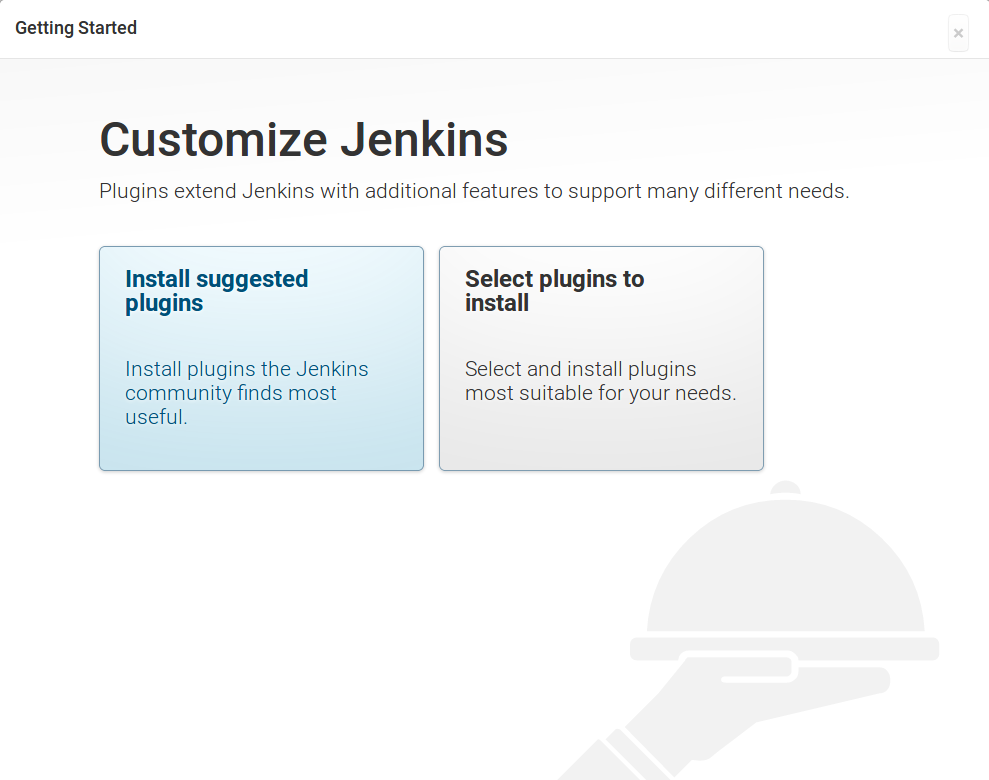
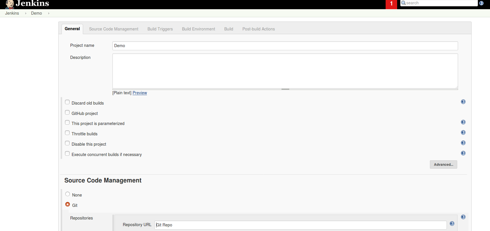

# OpenStack Image Factory

## The Factory

Each episode presented a Heat stack based on a unique pre-built server image. These images were already packed with the related tools for a faster deployment. The toolbox used to create these practical images is simple and efficient... and completely open-source:

* *Debian Jessie:* OS on which the Factory rests.
* *Openstack CLI:* Crucial for integrating the images into the Cloudwatt Platform
* *Packer:* Created by Hashicorp, this tool utilizes a Builder and Provisioner system to assemble the server images for various platforms, notably OpenStack.
* *Ansible:* A configuration tool from the same family as Puppet, Chef, and SaltStack. The lack of need for an agent in order to function sets Ansible apart.
* *Shell:* Bash is great.

To facilitate you in the creation of new images, we've place our assembly line [on Github](https://github.com/cloudwatt/os_image_factory).
 
We've also prepared a HEAT stack that will provide you with an image build server with all the necessary tools. For a little
more comfort, we added a Jenkins server in the toolbox. So, to start your own factory:

The prerequisites to deploy this stack :

* Your [Flexible Engine account](https://console.prod-cloud-ocb.orange-business.com),
* An existing [existing key pair](https://console.prod-cloud-ocb.orange-business.com/ecm/?agencyId=31f8f902b5ab4b05b0c767f5c79d2cae&region=as-west-0&locale=en-us#/keypairs/manager/keypairsList)
* Launch the HEAT stack that will assemble the factory via [OneClick](https://www.cloudwatt.com/en/applications/) or directly by retrieving the Heat template on [the cloudwatt github](https://github.com/cloudwatt/os_image_factory/tree/master/setup)

The provisioning of this server is done starting from a **bundle** images with all the necessary tools. To minimize the risks, we decided to only allow connections via SSH. To access the plant's Jenkins,
An SSH tunnel with port forwarding, between your machine and the server :

```
ssh $FACTORY_IP -l cloud -i $YOU_KEYPAIR_PATH -L 8080:localhost:8080
```

You should be able to access the factory Jenkins by clicking [here](http://localhost:8080)

To complete the installation, a manual operation is necessary. You have to manually in  ```/var/lib/jenkins/secrets/initialAdminPassword``` file via the SSH connexion.

```
sudo cat /var/lib/jenkins/secrets/initialAdminPassword
```

Install Suggested Plugins



Enter now your informations that will secure your jenkins. 
Keep in mind that all of you Cloudwatt account information are saved by jenkins. That's why the security is a very important thing with this Factory.


Jenkins is now initialized.

First of all, discovering the assembly line to know the build process.

## The Assembly Line

In the `images/` directory you will find 4 files essential to the creation of new images.

* `ansible_local_inventory`: Ansible inventory file, injected by Packer into the provisioning image to allow Ansible to target the server.
* `build.packer.json`: Packer build file. It takes into account the parameters given to it by the Ansible playbook.
* `build.playbook.yml`: Ansible playbook which pilots the building of images.
* `build.sh`: Short shell script to simplify the use of the Ansible playbook.

The `images/` subdirectories are build examples, each containing the files needed to create a server image. To create your own just apply to following norm:

~~~
images/
    bundle-my-bundle/             # <-- Build directory
        ansible/
            bootstrap.yml         # <-- Ansible playbook for server provisioning
        output/
            my_stack_heat.yml.j2  # <-- Template to generate at the end of the build, currently a Heat template
        build-vars-fe           # <-- Build variables/settings
~~~

The `.j2` ([Jinja2](http://jinja.pocoo.org/)) templates you place in `bundle-my-bundle/output/` will be interpreted by the piloting Ansible playbook. We use them to generate your bundle's Heat template:

~~~ yaml
server:
    type: OS::Nova::Server
    properties:
      key_name: { get_param: keypair_name }
      image: {{ result_img_id }}             # <-- Will be replaced by generated image ID
      flavor: { get_param: flavor_name }
      networks:

~~~

The `build-vars-fe` file contains the variables given to the piloting Ansible playbook:

```
SOURCE_IMAGE_ID=d57abb8b-2010-4f23-bb00-2999d4d3b5d5  <----  Source Image ID
AZ_NAME=eu-west-0a <----- AZ for build
MINDISK=40 <----- min disk for image property
MINRAM=1024 <------ min ram for image property
```


Now that you have knowledge of the entire assembly line of an image, you can start  building your own image bundle.

## Jenkins, would you kindly...

You've coded your own bundle and set the variables in `build-vars-fe`. Ready to try building an image?

**1.** First add your Flexible Engine credentials in `/var/lib/jenkins/honey.sh`
~~~
export OS_IDENTITY_API_VERSION=3
export OS_PROJECT_ID=***********
export OS_PASSWORD=***************
export OS_AUTH_URL=https://iam.eu-west-0.prod-cloud-ocb.orange-business.com/v3
export OS_USERNAME=***************
export OS_TENANT_NAME=eu-west-0
export OS_USER_DOMAIN_ID=**********
export OS_REGION_NAME=eu-west-0
export OS_ENDPOINT_TYPE=publicURL
export CINDER_ENDPOINT_TYPE=publicURL
export OS_VOLUME_API_VERSION=2
export OS_IDENTITY_API_VERSION=3
export OS_IMAGE_API_VERSION=2
export OS_USER_DOMAIN_NAME=********
export OS_DOMAIN_NAME=OCB****
export S3_ACCESS_KEY_ID="********"
export S3_SECRET_ACCESS_KEY="*********"
export S3_HOSTNAME="oss.eu-west-0.prod-cloud-ocb.orange-business.com"
~~~

**2.** Make sure to push your copy of the *os_image_factory* to a remote Git repository; Github, Bitbucket, whatever you use.

**3.** Open your Jenkins console in a browser and create a new job by clicking on **New Item**
 
**4.** Fill in the **Item name** (preferably the name of your bundle for simplicity), select **Freestyle project**, and click **OK**.
 
**5.** The first section of the settings is up to you; the default works fine. Under **Source Code Management** choose **Git**.

**6.** Specify the **Repository URL**, as well as **Credentials** if the project cannot be cloned with public permissions. Other permissions are inconsequential.
 
**7.** Near the end of the settings, choose **Execute shell** under **Add build step**, and input the following (replace `$BUNDLE_DIR_NAME`):
```
cd images_fe && ./build_fe.sh $BUNDLE_NAME
```

`$BUNDLE_DIR_NAME` must correspond to the directory under `images/` in which you have created your bundle. With the setup above, `$BUNDLE_DIR_NAME` would be `bundle-my-bundle`.

 
 
**8.** Select **Archive the artifacts** under **Add post-build action** and input ```packer.latest.log,images/target/$BUNDLE_DIR_NAME/output/*```. This isn't required, but prevents you from having to fish around for the generated Heat template or playbook log. Also, artifacts are saved *per build*, meaning that artifacts aren't lost with every new build.

**9.** Start your **Build**

## Making OS Image

The factory also serves to make our own OS images that we offer to Cloudwatt customers.
You can find all the creation scripts in the `OS` directory on Cloudwatt github [OS_image_factory] (https://github.com/cloudwatt/os_image_factory.git)

The process to make an OS image and Bundle image is almost the same, the start command is a little different because now you have to download the image in QCOW2 format and upload it in your **glance** before launching the build.
Here's how to do this:

```
cd os_fe/$OS_DIR_NAME/ && ./build_fe.sh
```

If you looked at the `build.sh` script in each OS directory, you might have noticed that a single test suite was running to test the image in our Openstack environment.
This is written in Python and you will find all the scripts in the **test-tools /pytesting_os_fe** directory.
For information nothing prevents you from adding your own test or modifying our own if necessary.

If you would like to create the image in both ```Cloudwatt``` and ```OCB Flexible Engine```, first
Add your credentials ```OCB Flexible Engine``` in the ```/var/lib/jenkins/honey.sh``` file, and run the following command:

```
make build-os os=$OS_DIR_NAME fe=true
```

## The Workspace

After a build, three outputs are expected:

* The server image itself, which will be added to your private Glance image catalog. The image ID can be easily found in the console output of the `build.sh` script.

* The Heat template generated by the piloting Ansible playbook, to be found in the directory **images/target/bundle-my-bundle/output/**.

* The Packer build logs, essential for debugging your bundle's Ansible playbook, can be found timestamped in **images/target/bundle-my-bundle/**, or the latest one can be easily found at the root, `packer.latest.log`.

## These are the keys...

The skeleton is in place and the toolbox is ready. If you wish to realize your own creations, take inspiration from the builds in the repository. Increase your knowledge of [Ansible](http://docs.ansible.com/ansible/index.html) and it's [playbook modules](http://docs.ansible.com/ansible/list_of_all_modules.html).

Hell, hack the `build.packer.json` file and configure in Puppet or Chef instead, if you want.

We hope our work can serve as a foundation for your own development architectures in the future.

------
Have fun. Hack in peace.
