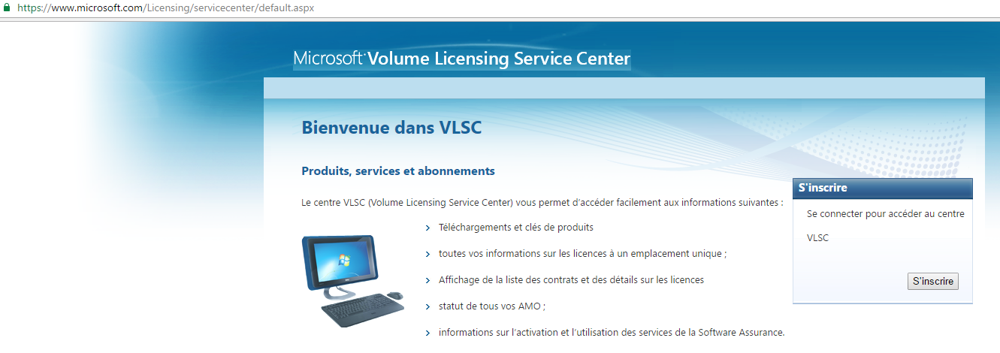
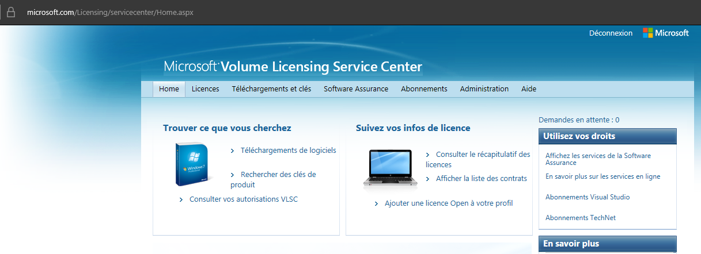
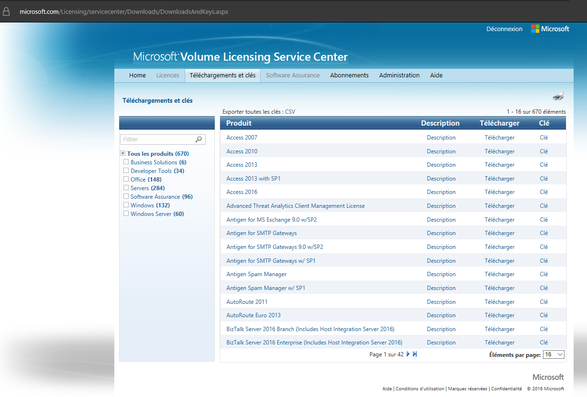

# Processus de préparation d'une image Windows

La création d'une image Windows est basée sur la procédure standard implémentée par  [Cloudbase-Init pour Openstack](https://cloudbase.it/cloudbase-init/). Le set complet de scripts Cloudbase-Init pour les images Windows sur Openstack se trouve sur le [repository GitHub de Cloudbase pour les images Windows sur Openstack](https://github.com/cloudbase/windows-openstack-imaging-tools).

La description originale du processus de création d'images Windows comme il est implémenté par Cloudbase est disponible dans le [README](windows-openstack-imaging-tools/README.md) repris avec notre copie de repository Cloudbase-Init. 

## Pré-requis

Les éléments suivants sont nécessaires avant lancer le processus de préparation :

a. Image (ISO) Windows de base  
Les ISO Windows de base doivent provenir du [Volume Licensing Center](https://www.microsoft.com/Licensing/servicecenter/Home.aspx) de Microsoft.

b. Image (ISO) de [pilotes virtIO](http://alt.fedoraproject.org/pub/alt/virtio-win/stable/) nécessaires pour les virtualiseurs KVM (à la base de la plateforme Cloudwatt)

### Procédure de récupération d'images (ou logiciels) Windows depuis le Volume Licensing Center

- D'abord, solliciter le droits d'accès auprès des administrateurs habilités pour la société
- Une fois le email de bienvenue reçu, accéder [https://www.microsoft.com/Licensing/servicecenter/default.aspx](https://www.microsoft.com/Licensing/servicecenter/default.aspx) :



(attention, utiliser les conditions : navigateur, compte Microsoft, ... confirmées par la société)

- Après avoir saisi vos identifiants (toujours sélectionner "S'inscrire"), vous y serez connecté :



- Vous pourrez ensuite sélectionner "Téléchargement et clés" et télécharger votre image ou logiciel.




## Compréhension des artefacts


Les artefacts principaux sont récupérés depuis le [repository GitHub de Cloudbase pour les images Windows sur Openstack](https://github.com/cloudbase/windows-openstack-imaging-tools), qui est copié intégralement dans le dossier "windows-openstack-imaging-tools". Toute la structure des fichiers est gardée identique à la source, à  l'exception des fichiers suivants :

- UnattendTemplate-EN.xml (nouveau) - template de sysprep spécifique aux versions anglaises d'OS
- UnattendTemplate-FR.xml (nouveau) - template de sysprep adapté aux versions françaises d'OS
- Fichiers dans le dossier /UnattendResources, spécifiques aux préparations d'autres types d'images (ex.  SQL Server) :
    - Logon.ps1 [Modifié] :Ce fichier est le script principal qui s'exécute sur la VM de préparation de l'image. Il finit avec un sysprep et arréte la VM.
    - Logon-Finalize.ps1 [Nouveau] Script de finalisation/sysprepé faire exécuter sur une VM de préparation qui a exécuté déjà Logon.ps1 mais sans l'étape de sysprep.
    - SetupLicenseCmds.cmd [Nouveau] : Script de config de volume licensing via VL Server de Cloudwatt. Il sera inclus automatiquement dans [WinDir]\Setup\Scripts\SetupComplete.cmd pour être exécuté ensuite sur chaque setup de VM provisionnée à partir de l'image.
    - Dossier SQL [Nouveau] : Contient all the scripts necessaires pour la création des images spécifiques SQL Server (selon les différentes versions)

    Pour plus d'informations, consulter le [README du dossier /UnattendResources](windows-openstack-imaging-tools/UnattendResources/README.md).


## Processus de préparation

Il y a 4 grandes étapes :

 1. Préparation de l'espace de travail
 1. Création de disque OS de préparation
 1. Exécution de VM de préparation et sysprep pour l'image finale
 1. Publication de l'image sur Cloudwatt

### 1. **Préparation de l'espace de travail**


### 2. **Création de disque OS de préparation**

Première étape : à partir de l'ISO Windows et de l'ISO de pilotes virtIO, le script génère un disque VHD contenant les artefacts nécessaires pour l'étape 2 et ensuite le convertit en format qcow2.

Le script *generate-win-qcow2.ps1*,  qui prédéfinit le paramétrage pour 4 types d'images : Windows Server 2008 R2 EN/FR et Windows Server 2012 R2 EN/FR, orchestre le processus à partir des fonctions mises à disposition dans */windows-openstack-imaging-tools/WinImageBuilder.psm1*. 

Voici un extrait du script *generate-win-qcow2.ps1* :

```powershell
#
# Ce script est dépendant du repository windows-openstack-imaging-tools-master
# Une copie complete du repository est maintenue (pas de référence type sous-module)
# Note: windows-openstack-imaging-tools-master a un autre sous-module (windows-curtin-hooks\curtin), mais qui ne sera pas utilisé dans cette génération
#
# AVANT : COPIER CE SCRIPT A LA BASE DU DOSSIER DE TRAVAIL
# 
# Assume le repertoire courant étant celui où se trouve le script

$crtDir = Get-Location # "D:\work2012r2"

$installUpdates = $true

$outBaseDir = "$crtDir\out"
$isoPath = "D:\ISOs"
$virtIOISOPath = "$isoPath\virtio-win-0.1.102.iso"

$relativePathToImagingTools = "cloudwatt-base-image-factory\images\windows\windows-openstack-imaging-tools"


# Bloc de paramètres à décommenter selon le type d'image ciblée

# 2012R2 EN
#$mainIso = "$isoPath\2012R2\SW_DVD9_Windows_Svr_Std_and_DataCtr_2012_R2_64Bit_English_-4_MLF_X19-82891.ISO"
#$imageIndex = 1
#$virtualDiskPath = "$outBaseDir\winimage2012r2-EN.qcow2"
#$unattendSourceFile = "UnattendTemplate-EN.xml"

...
...

# The disk format can be: VHD, VHDX, QCow2, VMDK or RAW
New-WindowsCloudImage -WimFilePath $wimFilePath -ImageName $image.ImageName `
    -VirtualDiskFormat QCow2 -VirtualDiskPath $virtualDiskPath `
    -SizeBytes 20GB -VirtIOISOPath $virtIOISOPath -InstallUpdates:$installUpdates

Dismount-DiskImage -ImagePath $mainIso

```


Une fois le disque de préparation créé (localement dans la VM workstation), il devra ensuite chargé (uploadé)  comme image privée dans Cloudwatt.

### 3. **Exécution de VM de préparation**

2ème étape : depuis le tenant Cloudwatt on crée une instance de VM à partir de l'image. Cette instance exécutera automatiquement la série d'étapes programmées (par le script [Logon.ps1](windows-openstack-imaging-tools/UnattendResources/Logon.ps1)) dans la création du disque d'origine : mises à jour Windows,  nettoyage du disque et des logs, installation de MSI Cloudbase,  inclusion des scripts de logon customisés (ex.  activation licence).

Avant l'opération de sysprep (généralisation), un point de pause a été configuré, pour pouvoir s'y connecter (via RDP),  vérifier l'état d'avancement et surtout faire un snapshot de la VM. Le script pourra ensuite être continué pour aboutir à l'arrêt de la VM sysprep-ée. A ce point, on fait le snapshot final d'image et on supprime la VM. 

Donc on peut décomposer cette étape en deux:

2.1 *Exécution de préparation avant sysprep*  
2.2 *Sysprep et arrêt de la machine*.

Pour les cas où le script Logon.ps1 sera arrêté complètement à la pause (ex. redémarrage de la machine nécessaire, restauration à partir du snapshot, préparation d'autres applications comme SQL Server etc. ), le script [Logon-Finalize.ps1](windows-openstack-imaging-tools/UnattendResources/Logon-Finalize.ps1) sera lancé manuellement à la fin pour conclure avec sysprep (et l'arrêt de la machine).

#### Connexion à distance sur la VM de préparation

Pour pouvoir de connecter à distance sur la VM de préparation et contrôller l'avancement des scripts, il faudra avoir une VM dans le même réseau local (ce pourrait être la workstation même) et faire une connexion RDP depuis cette machine, avec;

* utilisateur : "administrator" (pour les images en EN) / ou "administrateur" (pour les images en FR),
* mot de passe : "Pa$$w0rd" (comme préconfiguré par défaut dans le paramétrage de la fonction de création de disque, au point 1)

#### Préparation particulère d'une image - processus customisé SQL Server

Comme précisé, dans certains cas, une préparation particulière devrait être faite entre les étapes 2.1 (avant le sysprep) et 2.2. L'exemple concret est celui des **images SQL Server** sur Windows Server.

A partir de l'image Windows Server sélectionnée, les commentaires de chaque fichier Logon-SQLSetup-SQLXXXXYYYY.ps1 décrivent le processus supplémentaire à suivre pour ces images :

```powershell
#Cmd line


# SQL 2012 Evaluation

# INSTALL .NET Framework 3.5 Windows Feature prior to SQL install 
# COPY SQLFULL_FRA.iso to C:\MSSQLSetup (or download it)
# COPY MSSQL2012Eval-ConfigurationFile.ini to C:\MSSQLSetup
# COPY MSSQL2012Eval-FinalizeConfig.ini to C:\MSSQLSetup
# COPY cloudbase-postinitscript-SQL2012Eval.ps1 to "C:\Program Files\Cloudbase Solutions\Cloudbase-Init\LocalScripts"
# CHECK (if not already) ..\SetupLicenseCmds.cmd within C:\Windows\Setup\Scripts\SetupComplete.cmd 
# COPY  (if not already) ..\Logon-Finalize.ps1 to C:\Windows\Temp

Mount-DiskImage -ImagePath C:\MSSQLSetup\SQLFULL_FRA.iso
D:\Setup.exe /ConfigurationFile="C:\MSSQLSetup\MSSQL2012Eval-ConfigurationFile.ini"
# SSMS missing, not sysprep-able ; will install it afterwards
D:\Setup.exe /ConfigurationFile="C:\MSSQLSetup\MSSQL2012Eval-ConfigSSMS.ini"

# ACTIVATE UPDATES FOR OTHER MICORSOFT PRODUCTS
# CHECK & APPLY UPDATES (Windows, SQL, ...)

# REMOVE MSSQL2012Eval-ConfigurationFile.ini from C:\MSSQLSetup
# reactivate IESC

# MAKE A SNAPSHOT OF THE VM!

C:\Windows\Temp\Logon-Finalize.ps1
```

 


### 4. **Publication de l'image sur Cloudwatt**

TODO openstack-image-metadata.sh


### Tests

TODO

### Références

- [Cloudbase-Init pour Openstack](https://cloudbase.it/cloudbase-init/)
- [Repository GitHub de Cloudbase pour les images Windows sur Openstack](https://github.com/cloudbase/windows-openstack-imaging-tools)
- Sysprep 

### Images privées sauvegardées

TODO