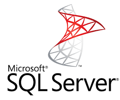
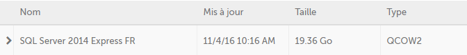
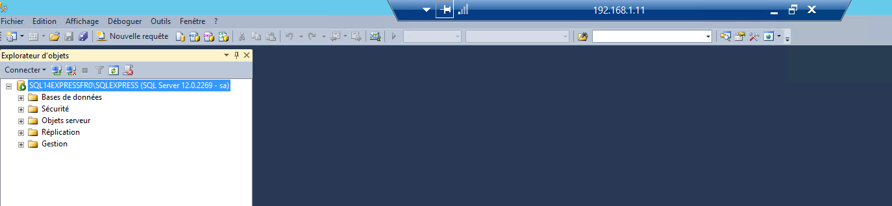

# 5 Minutes Stacks, épisode XX : Microsoft SQL Server #

## Episode XX : Microsoft SQL Server, sur Windows Server 2012 R2 ##

**[Microsoft SQL Server](http://www.microsoft.com/sql-server)** est le serveur de base de données produit par Microsoft, utilisé très largement sur la plateforme Windows Server. A part le moteur de bases de données lui-même, le produit réunit une multitude de fonctionnalités, comme Replication Server, Reporting Services (SSRS), Analysis Services (SSAS), Integration Services (SSIS), Master Data Servies, Data Quality Services etc..

MS SQL Server est predéployé dans des images Cloudwatt sur base de système d'exploitation Windows Server 2012 R2.

Les images contient les dernières mises à jour importantes (y compris patches de sécurité), ainsi pour Windows Server 2012 R2 que pour SQL Server lui-même.

### Versions de SQL Server disponibles ###

Niveau versions du produit, vous pourrez choisir parmis plusieurs versions de SQL Server, comme **SQL Server 2012**, ou **SQL Server 2014**; autres versions récentes suivront. Egalement, nous publions à la fois des versions localisées en ***anglais (EN)*** ou ***français (FR)***.

Les images de SQL Server chez Cloudwatt sont déclinées en édition légère gratuite (**SQL Server Express**) ou en éditions commerciales (comme **SQL Server Standard**) contenant les fonctionnalités plus complexes et permettant des performances supérieures.

### Fonctionnalités ###

Les images Cloudwatt prédéfinies *SQL Server* contiennent par défaut le moteur de base de données (une instance locale, nommée selon l'édition de serveur) ainsi que l'outil de gestion associé, *SQL Server Management Studio*. Vous pourrez ensuite évoluer et customiser les fonctionnalités installées, les binaires étant mis à disposition dans l'image.

### Performances ###

Les images SQL Server publiées seront fonctionnelles avec une VM qui respecte à minima les contraintes d'une image Windows Server 2012 R2 (à la base), c'est à dire une n2.cw.standard-1. Cependant, pour une bonne performance on recommande à minima 2 coeurs; aussi, une quantité supérieure de mémoire RAM donnera beaucoup plus de performance à vos requêtes SQL.

### Sécurité ###

Pour la simplicité du démarrage, les instances SQL Server sont préconfigurées en authentification SQL, avec mot de passe par défaut. C'est à vous de faire ensuite les changements de mot de passe, voire de changement de mode d'authentification (exemple, authentification intégrée Windows) pour sécuriser vos instances.

### Utilisation ###

D'abord, instanciez une VM basée sur l'image SQL Server sélectionnée par vous depuis le catalogue d'images Cloudwatt.

Par exemple, pour instancier une VM SQL Server 2014 Express FR, vous choisissez l'image suivante :

Les éléments essentiels pour instantier l'image sont les mêmes que pour une image classique :

- [Console Cloudwatt : Configurer et lancer une instance](https://support.cloudwatt.com/debuter/cons-3-configurer-lancer-instance.html)

La finalisation de l'instance prendra quelques minutes (le temps de configuration de Windows Server et ensuite la finalisation du setup de SQL Server).

Ensuite, connectez-vous à la machine créée via RDP :

- [Comment récupérer son mot de passe Windows ?](https://support.cloudwatt.com/kb/faq/controle-d-acces/comment-recuperer-son-mot-de-passe-windows.html)
- [Comment se connecter à une instance Windows en RDP ?](https://support.cloudwatt.com/kb/faq/controle-d-acces/comment-se-connecter-en-rdp.html)

Une fois connecté dans la machine, démarrez SQL Server Management Studio, soit via l'interface graphique (attention, UX à la Windows 8.1 :) ), soit tapez WIN+R (ou ouvrez une ligne de commande) et ensuite tapez la commande:

~~~cmd
ssms
~~~

Une fois SQL Server Management Studio démarré, vous vous connectez à l'instance locale:

Paramètres à utiliser : 
- Type du serveur : "Moteur de base de données" (par défaut)
- Nom du serveur : par défault (dans notre cas : "SQL14EXPRESSFR0\SQLEXPRESS")
- Authentification : sélectionnez "Authentification SQL Server"
- Connexion : "sa" (le compte SysAdmin par défaut)
- Mot de passe : "Pa$$w0rd"

C'est tout, vous êtes connecté à votre serveur de base de données:

## Pour aller plus loin ##

D'abord, pensez à changer le mot de passe pour "sa", voire changer votre mode de sécurité (ex. désactiver SQL Authentication et configurer l'authentification intégrée).

Egalement, vous pouvez tester la connectivité extérieure depuis une machine dans le même réseau, en configurant (conformement aux règles d'implémentation SQL Server) les protocoles exposés pour votre instance SQL Server.

Pour plus de détails sur Microsoft SQL Server, voici le [lien vers la documentation](https://technet.microsoft.com/fr-fr/library/mt590198(v=sql.1).aspx).
 