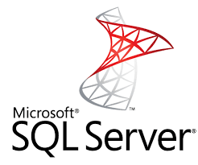
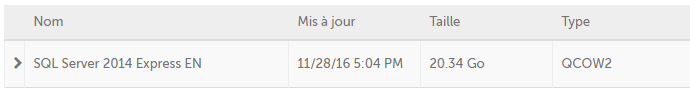
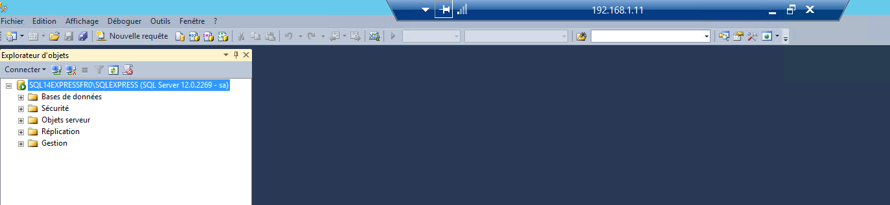

# 5 Minutes Stacks, episode XX : Microsoft SQL Server #

## Episode XX : Microsoft SQL Server, on Windows Server 2012 R2 ##

**[Microsoft SQL Server](http://www.microsoft.com/sql-server)** is Microsoft's database server, largely used on Windows Server platform. In addition to the database engine, the product includes a large set of features, such as Replication Server, Reporting Services (SSRS), Analysis Services (SSAS), Integration Services (SSIS), Master Data Servies, Data Quality Services etc..

MS SQL Server is predeployed on Cloudwatt images, based on  Windows Server 2012 R2 operating system. The images feature the latest important updates, for the OS as well as for SQL Server itself.

### Available SQL Server versions ###

Regardless of product versions, you can chose between multiple SQL Server versions such as **SQL Server 2012**, or **SQL Server 2014**; other recent versions will follow. Also, we publish at once ***English (EN)*** or ***French (FR)*** localized versions.

Cloudwatt's SQL Server images decline into the light free edition (**SQL Server Express**) as well as commercial editions (such as **SQL Server Standard**) containing more complex features and allowing better performance.

### Features ###

The predefined Cloudwatt's *SQL Server* images have setup by default the database engine (a named instance, depending on the server's edition) as well as the associated mannagement tool, *SQL Server Management Studio*. You can then evolve and customize the installed features, by using the binaries available in the image.

### Performances ###

The published SQL Server images will work correctly with a VM respecting the standard  constraints of a Windows Server 2012 R2 image, that means a n2.cw.standard-1 size. However, for a good performance we recommend at least 2 vCPUs; also, an extra RAM quantity will help a lot your SQL queries performing.

### Security ###

For the sake of simplicity at startup time, the SQL Server instances are configured ith SQL Authentication, with a default password. It's up to you, then, to change the default password, eventually change the authentication mode, in order to securize your instances.

### Usage ###

First, instantiate a VM based on the SQL Server image you intend to use, by selecting it from the Cloudwatt image catalog.

For example, in order to instantiate a SQL Server 2014 Express EN, you will chose the following image: 

The essential steps and parameters for isntantiating the image are the same as for any other Windows image:

- [Cloudwatt Console : Configure et lance an instance](https://support.cloudwatt.com/debuter/cons-3-configurer-lancer-instance.html)

The instance ill be ready in a few minutes (the time for getting the Windows Server configured and the time of finalizing the SQL Server setup).

Then, connect to the created machine via RDP: 

- [How to generate your Windows admin password?](https://support.cloudwatt.com/kb/faq/controle-d-acces/comment-recuperer-son-mot-de-passe-windows.html)
- [How to connect to a Windows instance via RDP?](https://support.cloudwatt.com/kb/faq/controle-d-acces/comment-se-connecter-en-rdp.html)

Once connected to the machine, launch SQL Server Management Studio, either via use interface (warning, UX à la Windows 8.1 :) ), or press WIN+R (or open a command-line) and then execute the command:

~~~cmd
ssms
~~~

Once SQL Server Management Studio started, you will connect to the local instance:

Parameters to use: 
- Server type : "Database engine" (by default)
- Server name : by default value (in our case : "SQL14EXPRESSFR0\SQLEXPRESS")
- Authentication : chose "SQL Server Authentication"
- Connection : "sa" (the default SysAdmin account)
- Password : "Pa$$w0rd"

That's all, you're now connected to your database server:

## Going Beyond That ##

First, be sure to change the "sa" password, or changing / adapting the security mode you intend to use (ex. deactivate SQL Authantication and use Windows Integrated Authentication).

Also, you can test the external connectivity from a VM within the same private network, by configuring (accordingly to SQL Server implementation best practices) the protocols exposed by your SQL Server instance.

For further details on SQL Server, here is the [link to the documentation](https://technet.microsoft.com/en-us/library/mt590198(v=sql.1).aspx).
 